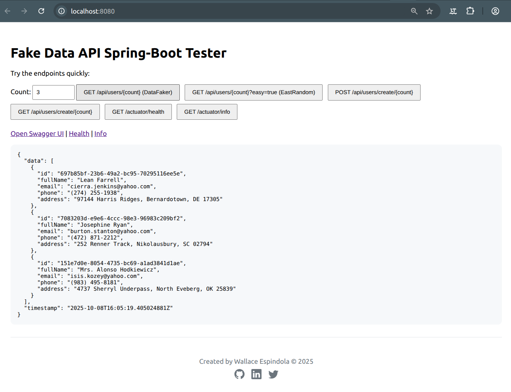
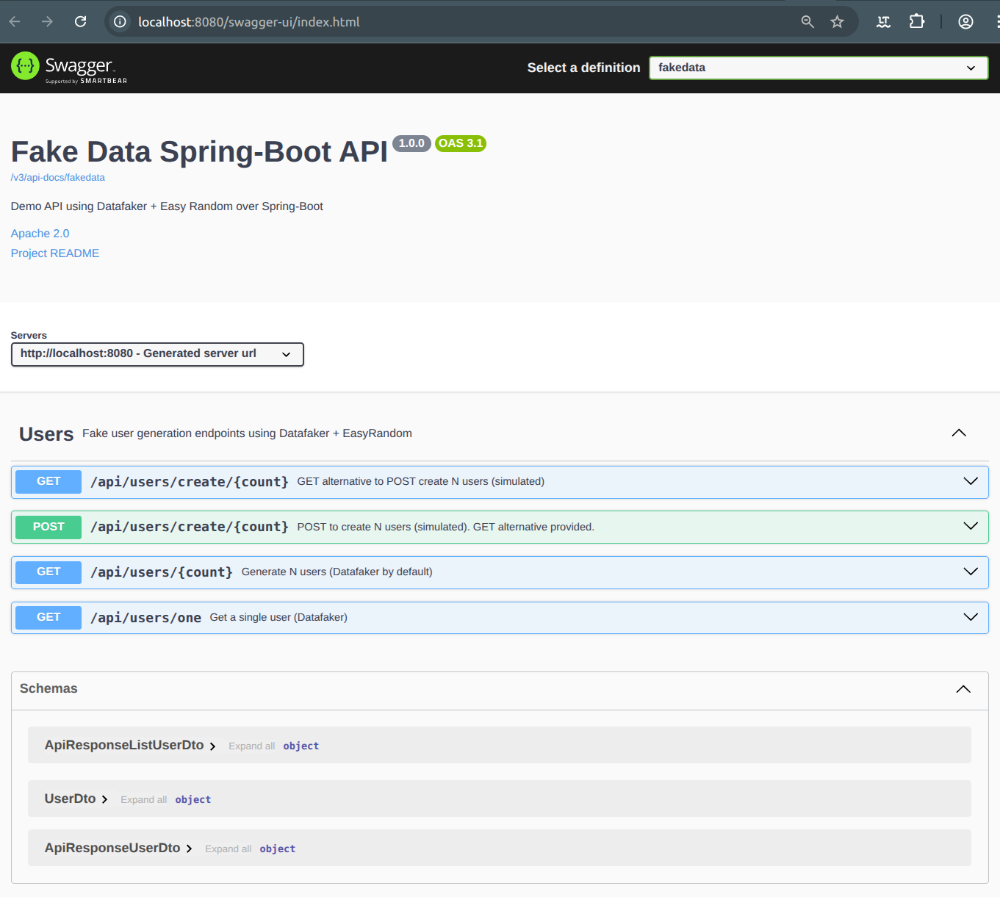

# Fake Data API - Spring Boot Demo


[](https://github.com/wallaceespindola/fake-data-springboot/actions/workflows/ci.yml)

## Introduction

A compact Java 21 / Spring Boot project showcasing **Datafaker** + **Easy Random** to generate fake users.

Includes Swagger UI, Actuator with custom health checks, Docker with health checks,
GitHub Actions CI/CD, Dependabot automation, comprehensive unit tests, Postman collection,
and a static tester page.

## Features

- 🎲 **Fake Data Generation**: Uses Datafaker and Easy Random libraries
- 📊 **REST API**: Generate single or multiple fake users via HTTP endpoints
- 📝 **API Documentation**: Interactive Swagger UI and OpenAPI 3 specs
- 💚 **Health Monitoring**: Spring Boot Actuator with custom timestamp indicator
- 🧪 **Comprehensive Testing**: Spring and non-Spring unit tests with 15+ test cases
- 🐳 **Docker Ready**: Multi-stage Dockerfile with health checks
- 🔄 **CI/CD**: GitHub Actions workflows for build, test, and Docker image publishing
- 🤖 **Automated Updates**: Dependabot for Maven, Docker, and GitHub Actions dependencies
- 📮 **Postman Collection**: Ready-to-use API testing collection

## Tech Stack

- **Java 21** - Latest LTS version
- **Spring Boot 3** - Web, Actuator
- **springdoc-openapi** - Swagger UI & OpenAPI 3
- **Datafaker** - Realistic fake data generation
- **Easy Random** - Random object generation
- **Maven** - Build automation
- **JUnit 5** - Unit testing framework
- **Lombok** - Reduce boilerplate code
- **Docker** - Containerization
- **GitHub Actions** - CI/CD automation

## Quick Start

### Using Maven

```bash
# Run the application
mvn spring-boot:run

# Or use Makefile
make run
```

### Using Makefile

```bash
make install    # Build and install (skip tests)
make test       # Run all tests
make run        # Start the application
make docker     # Build Docker image
make compose    # Run with Docker Compose
make clean      # Clean build artifacts
```

### Access the Application

- **Test UI**: [http://localhost:8080/](http://localhost:8080/)
- **Swagger UI**: [http://localhost:8080/swagger-ui.html](http://localhost:8080/swagger-ui.html)
- **OpenAPI JSON**: [http://localhost:8080/v3/api-docs](http://localhost:8080/v3/api-docs)
- **OpenAPI YAML**: [http://localhost:8080/v3/api-docs.yaml](http://localhost:8080/v3/api-docs.yaml)
- **Health Check**: [http://localhost:8080/actuator/health](http://localhost:8080/actuator/health)
- **Application Info**: [http://localhost:8080/actuator/info](http://localhost:8080/actuator/info)
- **Actuator Endpoints**: [http://localhost:8080/actuator](http://localhost:8080/actuator)





## API Endpoints

### Generate Users

```http
GET /api/users/generate?count=5&easy=false
```

**Parameters:**

- `count` (optional, default=10): Number of users to generate
- `easy` (optional, default=false): Use Easy Random (true) or Datafaker (false)

**Response:**

```json
{
  "timestamp": "2025-10-06T15:30:45.123Z",
  "data": [
    {
      "id": "550e8400-e29b-41d4-a716-446655440000",
      "fullName": "John Doe",
      "email": "john.doe@example.com",
      "phone": "+1-555-123-4567",
      "address": "123 Main St, New York, NY 10001"
    }
  ]
}
```

## Testing

The project includes comprehensive test coverage:

### Run All Tests

```bash
mvn test
# or
make test
```

### Test Files

1. **UserControllerTests.java** - Spring integration tests for the controller
2. **DataGenServiceTest.java** - Spring-based service tests (15 test cases)
3. **DataGenServiceUnitTest.java** - Fast non-Spring unit tests (15 test cases)
4. **DataFakerLocaleTest.java** - Locale handling tests for Datafaker

### Test Coverage

- ✅ User generation with Datafaker
- ✅ User generation with Easy Random
- ✅ Bulk user generation
- ✅ Email format validation
- ✅ Unique ID generation
- ✅ Edge cases (zero, negative counts)
- ✅ Field population validation

## Docker

### Build and Run

Build the image (multi-stage Dockerfile):

```bash
docker build -t fake-data-springboot:latest .
# or
make docker
```

Run the container:

```bash
docker run --rm -p 8080:8080 --name fake-data-api fake-data-springboot:latest
```

### Docker Compose

The `docker-compose.yml` includes:

- Container health checks using Actuator endpoint
- Automatic restart policy
- JVM memory configuration
- Port mapping

```bash
# Start services
docker compose up --build

# Start in detached mode
docker compose up --build -d

# Stop and remove resources
docker compose down
```

### Docker Image Details

- **Build Stage**: Uses `maven:3.9-eclipse-temurin-21` for compilation
- **Runtime Stage**: Uses `eclipse-temurin:21-jre` for smaller image size
- **Health Check**: Monitors `/actuator/health` endpoint every 30 seconds
- **Optimization**: Dependency caching for faster rebuilds

## GitHub Actions

The project includes three automated workflows:

### 1. CI Workflow (`.github/workflows/ci.yml`)

- Triggered on push/PR to `main` and `develop` branches
- Builds with Maven
- Runs all tests
- Generates test reports
- Uploads JAR artifacts (30-day retention)

### 2. Docker Build Workflow (`.github/workflows/docker.yml`)

- Builds and pushes Docker images to GitHub Container Registry
- Supports semantic versioning tags
- Includes Docker Scout security scanning
- Uses build caching for optimization

### 3. CodeQL Security Analysis (`.github/workflows/codeql.yml`)

- Automated security vulnerability scanning
- Runs weekly on Monday at midnight
- Reports findings in GitHub Security tab

## Dependabot

Automated dependency updates configured for:

- **Maven dependencies**: Weekly updates (Mondays at 9 AM)
    - Groups: Spring Boot, Testing frameworks, Lombok
    - Ignores major version updates by default
- **Docker base images**: Weekly updates
- **GitHub Actions**: Weekly updates

All PRs are auto-labeled and assigned for review.

## Project Structure

```
fake-data-springboot/
├── .github/
│   ├── workflows/
│   │   ├── ci.yml              # CI workflow
│   │   ├── docker.yml          # Docker build workflow
│   │   └── codeql.yml          # Security scanning
│   └── dependabot.yml          # Dependency automation
├── src/
│   ├── main/
│   │   ├── java/.../fakedata/
│   │   │   ├── Application.java
│   │   │   ├── controller/     # REST controllers
│   │   │   ├── service/        # Business logic
│   │   │   ├── domain/         # Domain models
│   │   │   ├── dto/            # Data transfer objects
│   │   │   ├── mapper/         # Object mappers
│   │   │   └── config/         # Spring configuration
│   │   └── resources/
│   │       ├── application.properties
│   │       └── static/
│   │           └── index.html  # Test UI
│   └── test/
│       └── java/.../fakedata/
│           ├── DataFakerLocaleTest.java
│           ├── controller/
│           │   └── UserControllerTests.java
│           └── service/
│               ├── DataGenServiceTest.java
│               └── DataGenServiceUnitTest.java
├── postman/
│   └── FakeDataAPI.postman_collection.json
├── Dockerfile                  # Multi-stage Docker build
├── docker-compose.yml          # Docker Compose configuration
├── Makefile                    # Build automation
└── pom.xml                     # Maven configuration
```

## Configuration

Key application properties (`application.properties`):

```properties
# Server configuration
server.port=8080
# Actuator endpoints
management.endpoints.web.exposure.include=health,info
management.endpoint.health.show-details=always
# Application info
spring.application.name=fake-data-springboot
```

## Notes

- Health endpoint exposes details with `management.endpoint.health.show-details=always` and adds a `timestamp` via a
  custom `HealthIndicator`
- The application uses Lombok annotations to reduce boilerplate code
- Docker Compose includes health checks and restart policies for production use
- GitHub Actions workflows provide full CI/CD automation
- Dependabot keeps dependencies up-to-date automatically

## Contributing

1. Fork the repository
2. Create a feature branch (`git checkout -b feature/amazing-feature`)
3. Commit your changes (`git commit -m 'Add amazing feature'`)
4. Push to the branch (`git push origin feature/amazing-feature`)
5. Open a Pull Request

## Author

- Wallace Espindola, Sr. Software Engineer / Solution Architect / Java & Python Dev
- **LinkedIn:** [linkedin.com/in/wallaceespindola/](https://www.linkedin.com/in/wallaceespindola/)
- **GitHub:** [github.com/wallaceespindola](https://github.com/wallaceespindola)
- **E-mail:** [wallace.espindola@gmail.com](mailto:wallace.espindola@gmail.com)
- **Twitter:** [@wsespindola](https://twitter.com/wsespindola)
- **Gravatar:** [gravatar.com/wallacese](https://gravatar.com/wallacese)
- **Dev Community:** [dev.to/wallaceespindola](https://dev.to/wallaceespindola)
- **DZone Articles:** [DZone Profile](https://dzone.com/users/1254611/wallacese.html)
- **Pulse Articles:** [LinkedIn Articles](https://www.linkedin.com/in/wallaceespindola/recent-activity/articles/)
- **Website:** [W-Tech IT Solutions](https://www.wtechitsolutions.com/)
- **Slides:** [Speakerdeck](https://speakerdeck.com/wallacese)

## License

- This project is released under the Apache 2.0 License.
- See the [LICENSE](LICENSE) file for details.
- Copyright © 2025 [Wallace Espindola](https://github.com/wallaceespindola/).